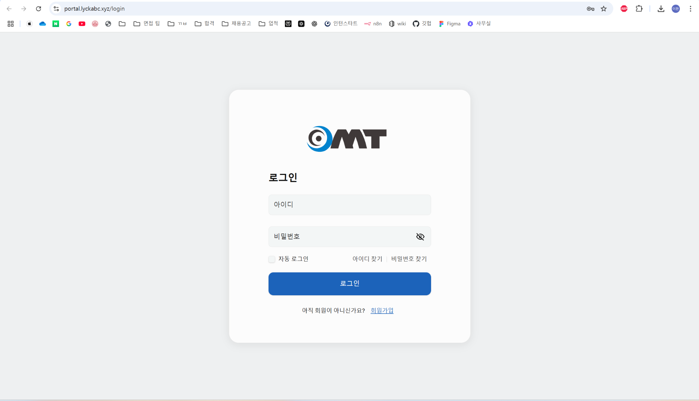
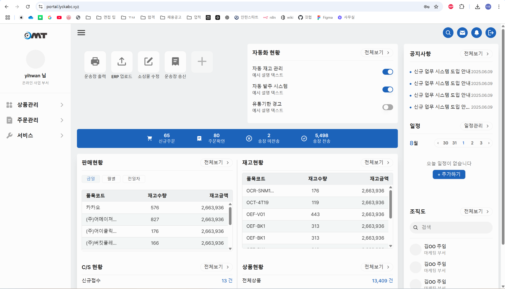

# 💼 Internship Projects

---

## neunexus_login
TypeScript 기반 로그인 UI 구현 프로젝트.

- **주요 기능**: 로그인 페이지 UI 설계, API 연동, 인증 로직 처리
- **내 역할**: UI 컴포넌트 개발, 상태관리, 코드 리팩토링  
[🔗 GitHub Repository](https://github.com/GopediaPro/neunexus_login)  
[📂 코드 보기 - components](./neunexus_login_components)  
[📂 코드 보기 - pages](./neunexus_login_pages)  
[📂 코드 보기 - stories](./neunexus_login_stories)



### 💻 기여 코드 예시
```bash
# 개발 서버 실행
npm run dev

# ESLint 검사
npm run lint

# 프로덕션 빌드 (TypeScript 컴파일 + Vite 빌드)
npm run build

# Storybook 실행
npm run storybook
```

---

## neunexus-client
TypeScript 기반 클라이언트 애플리케이션.

- **주요 기능**: 메인 UI 페이지 구현, API 데이터 표시
- **내 역할**: 페이지 구조 설계, UI 최적화  
[🔗 GitHub Repository](https://github.com/GopediaPro/neunexus-client)  
[📂 코드 보기 - components](./neunexus_client_components)  
[📂 코드 보기 - pages](./neunexus_client_pages)  
[📂 코드 보기 - stories](./neunexus_client_stories)

### 💻 기여 코드 예시
```typescript
// LoginButton.tsx
import React from "react";

export const LoginButton = () => {
  return <button>로그인</button>;
};
```

---

## sabangnet_API
Python 기반 Sabangnet API 연동 모듈.

- **주요 기능**: 상품 데이터 연동, API 호출 처리, 데이터 파싱
- **내 역할**: API 호출 모듈 작성, 예외 처리 로직 추가  
[🔗 GitHub Repository](https://github.com/GopediaPro/sabangnet_API)  
[📂 코드 보기 - controller](./sabangnet_api_controller)  
[📂 코드 보기 - models](./sabangnet_api_models)  
[📂 코드 보기 - repository](./sabangnet_api_repository)  
[📂 코드 보기 - utils](./sabangnet_api_utils)



### 💻 기여 코드 예시
```python
# 상품 데이터 조회 예시
import requests

response = requests.get("https://api.sabangnet.co.kr/products")
print(response.json())
```
